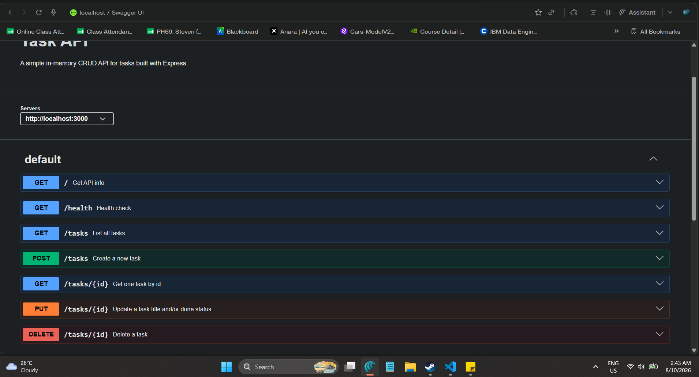

# Task API

A small CRUD API built with Node.js and Express for managing an in-memory to-do list. It supports creating, reading, updating, and deleting tasks, includes Swagger UI documentation at `/docs`, and was built as part of the FlyRank Backend Track Week 2 assignment.[1]

## Install and run

### Requirements

- Node.js
- npm

### Setup

```bash
npm install
```

### Run

```bash
node index.js
```

The server runs locally at `http://localhost:3000` and Swagger UI is available at `http://localhost:3000/docs`.[1]

## Endpoints

| Method | Path         | Description                      | Success status | Error status                                         |
| ------ | ------------ | -------------------------------- | -------------- | ---------------------------------------------------- |
| GET    | `/`          | Returns API metadata             | `200`          | -                                                    |
| GET    | `/health`    | Returns health status            | `200`          | -                                                    |
| GET    | `/tasks`     | Returns all tasks                | `200`          | -                                                    |
| GET    | `/tasks/:id` | Returns one task by id           | `200`          | `404` if task does not exist                         |
| POST   | `/tasks`     | Creates a new task               | `201`          | `400` if title is missing or empty                   |
| PUT    | `/tasks/:id` | Updates a task title and/or done | `200`          | `400` for invalid body, `404` if task does not exist |
| DELETE | `/tasks/:id` | Deletes a task                   | `204`          | `404` if task does not exist                         |

## Example curl -i output

Example request:

```bash
curl -i -X POST http://localhost:3000/tasks \
  -H "Content-Type: application/json" \
  -d '{"title":"Buy milk"}'
```

Example response:

```http
HTTP/1.1 201 Created
X-Powered-By: Express
Content-Type: application/json; charset=utf-8
Content-Length: 41
ETag: W/"29-example"
Date: Sun, 09 Aug 2026 00:00:00 GMT
Connection: keep-alive
Keep-Alive: timeout=5

{"id":4,"title":"Buy milk","done":false}
```

This matches the Stage 3 checkpoint, which requires `POST /tasks` to return `201 Created` and the new task JSON when a valid title is sent.[1]

## Swagger UI screenshot

Add your screenshot image to the repository, for example at `docs/swagger-screenshot.png`, then embed it here:



The assignment requires a Swagger UI screenshot in the README after `/docs` shows all endpoints and the full CRUD cycle works through “Try it out”.[1]

## Notes

- Data is stored only in memory, so restarting the server resets the task list to the three starter tasks. The assignment explicitly says there is no database yet and that losing data on restart is expected at this stage.[1]
- The documented CRUD cycle should work both through `curl -i` and through Swagger UI at `/docs`.[1]
